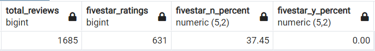

# Amazon Vine Review Analysis

## Overview

The following is an analysis of the US digital video game reviews on Amazon. It attempts to determine if there was a positivity bias in the review ratings based on reviews being part of the Vine program (paid).

## Results

Below is a summary of the analysis results. Showing the total reviews, number of 5-star reviews, and percent of 5-star reviews for both Vine and non-Vine reviews.

- There were 0 Vine reviews, and 1,685 non-Vine reviews.
- There were 0 5-star Vine reviews, and 631 non-Vine 5-star reviews.
- 0% of the Vine reviews were 5-star, and about 37.5% of the non-Vine reviews were 5-star.

## Summary

Analysis of US digital video game reviews on Amazon revealed that there was no positivity bias based on reviewers being part of the Vine program (paid). In fact, if you were to broaden the scope of the analysis to all reviews done, an additional query would show that there were no paid reviews at all within this dataset.

 
